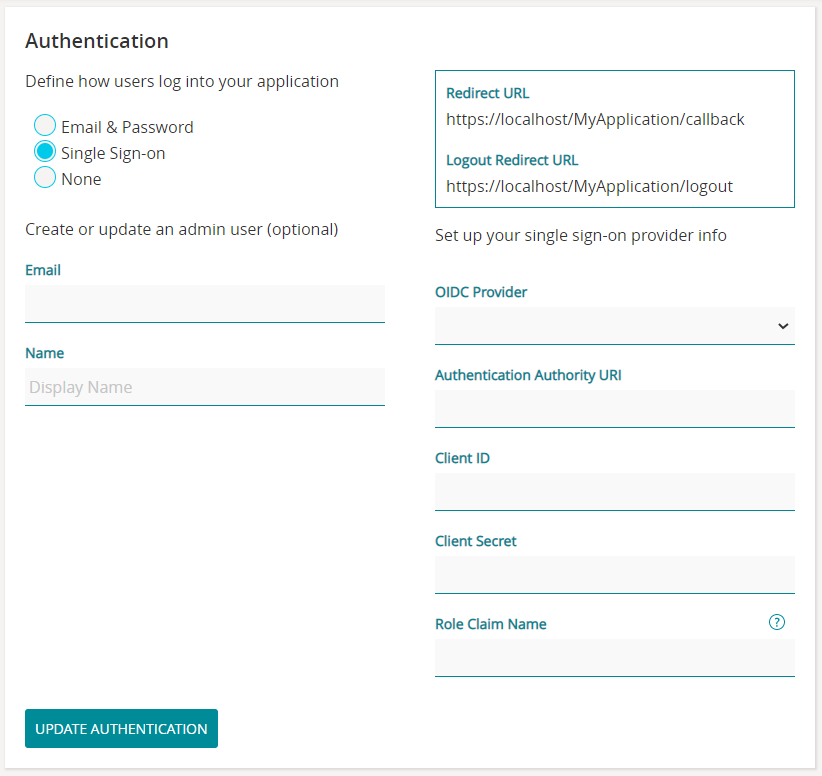

# Application Manager

The Stadium Application Manager enables you to manage key [server](https://about/docs/howitworks/applicationmanager#server) and [application](https://about/docs/howitworks/applicationmanager#application) settings.

***

\

### Server Management

Access Server management features from the Applications screen and from the server menu at the top of the screen.

#### Upload a new Application

Upload a new application file to Application Manager.

**Steps:**

1. On the Applications screen, click the Upload Application button.
2. Select your application file to upload.
3. Select your application's _Athentication_ method.\

   * _Email & Password_\
     &#x20;    Users will log in to your Application with their email adress and password.
   * \

   * _Single sign-on_:\
     &#x20;    Users will log in via the Authentication service that they are registered with: Auth0, Okta or Azure AD.
   * \

   * _None_\
     &#x20;    Users will not be required to log in and will have access to all pages in your Application.
   * \

4. \

5. Create your application's _Admin User_:\
   (An Admin User is a user that can access an application's administration features, i.e. maintaining user roles and users.)
   * When Authentication is _Email & Password_:\
     &#x20;    Provide Email, Password and a display Name.
   * \

   * When Authentication is _Single sign-on_:\
     &#x20;    Provide your Email and Name, as registered with your Authentication service provider.
   * \

   * When Authentication is _None_:\
     &#x20;    No Admin User will be created.
   * \

6. If required, edit your application's _Connections_ and _Settings_. (The values of "secret" settings will be blank; provide values now, or [later](https://about/docs/howitworks/applicationmanager#application) on Application Manager.)
7. Click the Create Application button.\

_Note:_ As an alternative to uploading an application from within Application Manager, it is also possible to [publish an application](.gitbook/assets/publish) from within Stadium Designer.

#### Server Configuration

Provide your SMTP (email) details from where password reminders will be sent to users who have forgotten their passwords. When SMTP details are added, a 'Forgot Password' feature will automatically be added to all your generated applications, as well as for _Application Manager_.

**Steps:**

1. Select _Configuration_ from the Server menu item (at the top of the screen).
2. Provide your email settings: _From Address, SMTP Server, SMTP Username, SMTP Password, SMTP Port_.
3. Click the Save Settings button.\

#### Maintain Users

Add, update or delete Application Manager users. (Note: These users are not your applications' Admin Users.)

**Steps:**

1. Select _Users_ from the Server menu item (at the top of the screen).
2. Click the Add User button.
3. Provide the _Email, Password_ and _Name_ of the user.
4. Click the Save button.\

***

\

### Application Management

To access the Application Management features, first select your Application on Application Manager.

#### Connections

The connection details of the Connectors (Database, web service or file system) that are part of your application.

**Steps:**

1. Select Connections from the menu on the left.
2. Click on the value of the applicable connection to edit.
3. Click the Save icon.\

#### Settings

The details of the Settings that are part of your application.

**Steps:**

1. Select Settings from the menu on the left.
2. Click on the value of the applicable setting to edit.
3. Click the Save icon.\

_Note:_ If a setting was set to "secret" in Stadium Designer, and not updated when the application was uploaded / deployed, the value of the setting will be blank on Application Manager and will have to be provided here.

#### Configuration

Set the maximum file size of any upload performed on your application.

**Steps:**

1. Select Configuration from the menu on the left.
2. Enter the maximum upload file size in MB.
3. Click the Save button.\

#### Authentication

Determine whether users must log in to gain access to your application and select how logins will be authenticated.

**Steps:**

1. Click the Authentication menu item.
2. Select the applicable Authentication method:\

   * _Email & Password_:\
     &#x20;    Users will log in to your Application with their email adress and password.
   * \

   * _Single sign-on_:\
     &#x20;    Users will be required to log in via the specified Authentication service: Auth0, Okta or Azure AD.\
     &#x20;    Go [here](.gitbook/assets/ApplicationManagerAuthentication) for help on how to set up Single sign-on authentication.
   * \

   * _None_:\
     &#x20;    Users will not be required to log in and will have access to all pages in your Application.
   * \

#### Debug Mode

To switch on debug mode so that users of the application can see detailed error messages. This is not a good user experience or safe, and should only be switched on for debugging purposes, after which it should be switched off again.

**Steps:**

1. Click the Debug Mode menu item.
2. Switch the Debug Mode On / Off.\

#### Generate an API key

Generate an API key to allow fetching, adding or updating users via a REST webservice.

**Steps:**

1. Click the User API menu item.
2. Click the Generate New Key button.

#### Update History

Your application's update history.

**Steps:**

1. Select Update History from the menu on the left.
2. Update history is displayed.

#### Delete Application

To delete your application from Application Manager. (This will not delete your application file from your machine. The application file will still be available to open with Stadium Designer or to re-upload to Application Manager.)

**Steps:**

1. Select Delete Application from the menu on the left.
2. Enter the name of the application.
3. Click the Delete button.\

\

***

? What next? [Maintain users and roles](broken-reference)\
