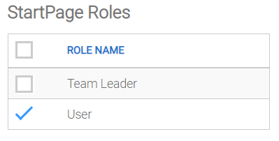

# Application Users and Roles

The users and roles of an application that has Login Mode set to _Email & Password_ can be maintained by the application's administration user(s).

***

### Access Application Users and Roles via your application

\

**Steps:**

1. Launch your application.
2. Click the profile icon  in the top-right corner of your application.
3. Select _Users & Roles_.
4. Enter your _Email_ and _Password_.
5. Click the Login button.\

***

### Roles

There is only one role that is created by default when your application is uploaded to Application Manager, which is the _User_ role. In this section you can maintain the different user roles that you require for your application.

_Maintain Roles_

**Steps:**

1.

    

    Click the Roles menu item.
2. To Add:
   1. Click Add Role.
   2. Enter a _Name_ for the Role.
   3. Select the _Pages_ to which this Role will have access.
   4. Click Save.
   5. \

3. Update:
   1. Click the Edit link associated with the relevant Role.
   2. Update _Name_ and / or which _Pages_ are assigned to the Role.
   3. Click Save.
4. \

5. Delete:
   1. Click the Delete link associated with the relevant Role.
   2. Click Yes to confirm.
6. \
   Note:
7.
   * The default Role is 'User'.
   * All users are automatically and permanently assigned to the 'User' role.
   * Additional Roles can be assigned to users, and can also be removed ("unassigned") from users.

***

### Users

_Users_

**Steps:**

1. Click the Users menu item.
2.

    

    To Add:

    1. Click Add User.
    2. If the Application's Login Mode is 'Email & Password':\
       &#x20;  \- Enter the user's _Name_, _Email_ and _Password_.\

    3. Select the _Administrator_ checkbox only if this User is to have Administration rights, i.e. to have access to Application Users and Roles.
    4. Select the _Role(s)_ to assign to the User.\

    5. Click Save.
    6. \

3. Update:
   1. Click the Edit link associated with the relevant User.
   2. Update _Email_, _Password_, _Name_ and / or which _Role(s)_ to assign to the User.
   3. Click Save.
4. \

5. Delete:
   1. Click the Delete link associated with the relevant User.
   2. Click Yes to confirm.

***

### Pages

Access to your application's pages can be controlled by assigning user roles to each page.

_Maintain Role assignments to Pages_

**Steps:**

1. Click the Pages menu item.
2. Click the Edit link associated with the relevant Page.
3. Select the _Role(s)_ to assign to the Page.
4. Click Save.
5. \
